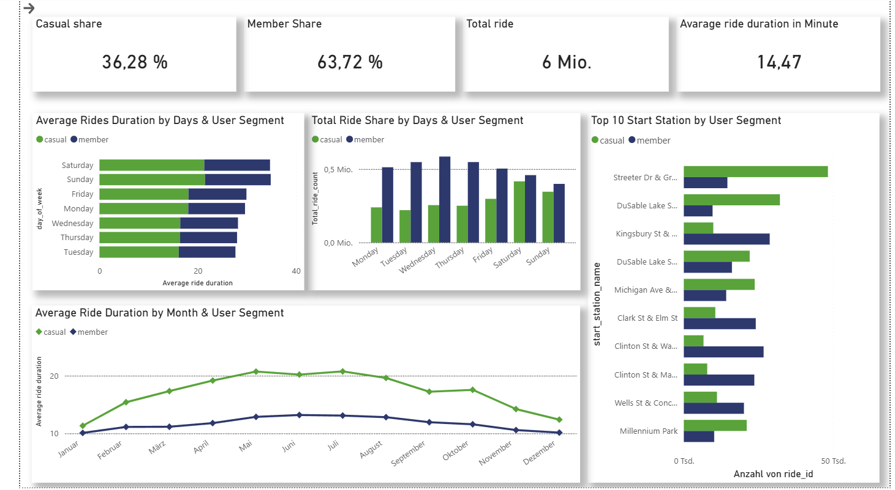
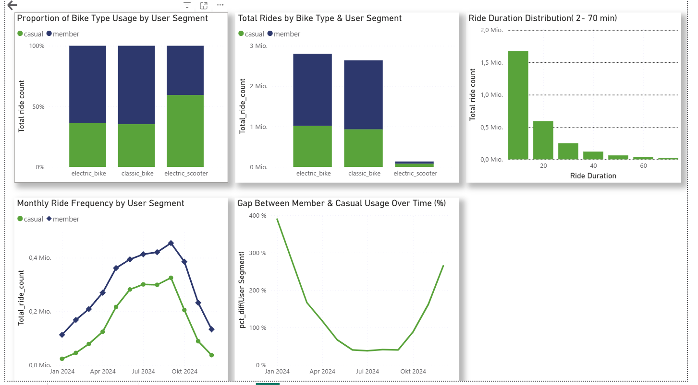

# cyclistic-bike-share-data-analysis
End-to-end data analytics project using Python and Power BI (DAX) to analyze cyclist ride data and uncover usage patterns.
## Project Overview
This project analyzes 12 months of Cyclistic bike-share data to understand user behavior and identify strategies to convert casual riders into annual members.
## Business Problem
Cyclistic wants to increase the number of annual memberships. The Key question is: <b> How do casual riders and members use Cyclistic bikes differently?</b>
## Tools Used
- Python (pandas) → data cleaning & preparation
- Power BI (Dax) → dashboard & visualization

## Data Source
Public bike trip data from Divvy (Chicago bike-share system), covering January–December 2024.
The dataset used in this project is publicly available:
![Cyclistic Bike-Share Dataset] (https://divvy-tripdata.s3.amazonaws.com/index.html)
Note:
- Raw data is not included due to size limitations
- A cleaned sample dataset is provided in this repository

## Data Cleaning (Python)
The dataset originally consisted of 12 monthly CSV files. These were concatenated into a single dataset using Python (pandas) to allow for unified analysis across the full year.
- Removed duplicate records
- Converted date columns to proper datetime format
- Created new features:
  - Ride duration
  - Month
  - Day of week    
- Checked for missing or inconsistent values
- Removed invalid ride durations (≤0)
- Cleaned dataset was then exported for Power BI analysis.
  
## Outlier Handling
Ride duration contained extreme values (e.g., up to 1439 minutes).
Based on distribution analysis, values were filtered to focus on realistic behavior:

Minimum threshold: ≥ 2 minutes
Maximum threshold: ≤ 70 minutes

This ensured that averages and distributions reflect typical usage patterns.

## Key Analysis and Visualisation
The Dashboard focuses on 
- Overall user behavior, comparing casual riders and members across time, location, and ride duration
- Ride frequency patterns across days and months
- Behavioral differences between casual riders and members
- Identification of peak usage periods
- Analysis of average ride duration and ride length distribution
## Key Insight
### User Behaviour
- Members dominate usage (63.72%), indicating strong adoption of subscription-based riding.
- Casual users take longer rides, especially on weekends which indicate leisure/tourism usage.
- Members ride more frequently during weekdays, indicating commuting behavior.
### User Behavior Over Time
- Members consistently generate higher ride frequency than casual users throughout the year
- Both user groups follow a similar seasonal pattern, increasing from winter to summer and declining toward the end of the year
- This suggests external factors (e.g., weather/seasonality) influence both segments similarly
### Time Patterns
- Ride volume is highest during weekdays for members, reinforcing commuting trends.
- Weekend rides increase for casual users, showing recreational usage.
- Ride duration peaks in summer months, indicating seasonal demand.
### Gap Between Casual & Member Usage
- The percentage difference between member and casual are highest at the begining and ending of the year which illustate the dominance of members  
  during those period.
- Meanwhile during Summer Period the gap narrowed down which illustrate the usage of bike by casual during that period.
- This shows that casual bike riders are highly seasonal while Members are consistent users.
## Product Usage
- Electric bikes generate the highest ride volume, making them the most important asset.
- Classic bikes are still heavily used, especially by members.
- Electric scooters have lower adoption, but a higher share among casual users.
## Location Insights
- Certain stations consistently rank highest, these are key operational hubs.
- Differences between casual and member station usage suggest:
- Casual users prefer tourist/high-traffic areas
- Members prefer commuting routes
## Ride Duration Behavior
- Majority of rides are short (under ~20 minutes) which aligns with urban mobility / commuting
- Long rides exist but are rare, mostly driven by casual users
## Business Recommendations
-	Target casual riders with weekend promotions
- Offer membership discounts based on usage patterns
- Design campaigns around leisure usage behavior
- invest more in electric bikes
- optimise bike avaliability at top stations especially during summer period
- Focus marketing campaigns on casual users before summer to maximize peak demand
- Offer incentives in winter to reduce the usage gap
## Dashboard Overview

## Bike_Usage Analysis

## Autor
Ikechukwu Caleb Mgbemeneh

